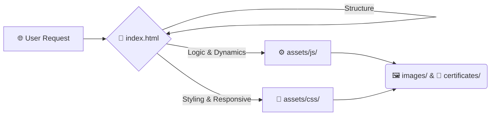

<div align="center">

<br />
  <h1>🌐 Thayss Tech Hub</h1>
  <p><strong>Professional Portfolio & Centralized Engineering Architecture</strong></p>

  <p>
    <a href="https://thayss-tech.github.io/WEB/">
      
    </a>
    
  </p>

  <p>
    
    
    
    
  </p>

</div>

---

## 📑 Table of Contents

| Section | Description |
| :--- | :--- |
| **💡 Overview** | Project mission and context. |
| **🏗️ Architecture** | Technical flow and design principles. |
| **⚙️ Core Engine** | Breakdown of logic and visual systems. |
| **🏅 Validation** | Professional certificates structure. |
| **🛠️ Customization** | How to use this site as your own template. |
| **🗺️ Repository Map** | Directory tree visualization. |
| **🚀 Deployment** | Live access information. |
| **📩 Contact** | Professional links. |

---

## 💡 Overview

This repository contains the full source code and infrastructure of my professional website.

It functions as a **centralized technical gateway**, explicitly engineered to:

* **⚛️ Present** my analytical background in Theoretical Physics.
* **📊 Showcase** applied Data Science and Machine Learning projects.
* **🔍 Provide** structured, transparent access for technical evaluation.

> *The core development objective is maximum clarity, performance, and technical transparency without relying on heavy frameworks.*

---

## 🏗️ Architectural Model

The platform is designed following a high-performance **Single Page Architecture (SPA-style static model)**.

### Operational Flow



#### Engineering Principles
* **⚡ Performance:** Lightweight, instant loading, zero backend overhead.
* **🛠️ Maintainability:** Strict separation of concerns (HTML/SASS/JS).
* **🎮 Full Control:** Direct manipulation of the vanilla frontend stack.

---

## ⚙️ Core Engine: `assets/`

The OPERATIONAL CORE of the platform, logically organized into four primary engineering subsystems:

<div align="center">

| Subsystem | Icon | Description | Key Files |
| :--- | :---: | :--- | :--- |
| **Visual Engineering** | 🎨 | Controls identity, layout, and responsiveness using SASS. | `main.scss`, `main.css`, `noscript.css` |
| **Interaction Layer** | ⚙️ | Manages dynamic behavior, animations, and viewport adjustments. | `main.js`, `breakpoints.min.js`, `jquery.min.js` |
| **Design Engineering** | 🔧 | The source SCSS architecture (variables, mixins, modules). | `_vars.scss`, `components/`, `layout/` |
| **Icon Infrastructure** | 🔠 | Locally hosted FontAwesome fonts for cross-browser reliability. | `.woff2`, `.ttf`, `.svg` |

</div>

---

## 🏅 Professional Validation

Beyond the technology stack, the repository is structured to hold and present critical professional assets:

* **🖼️ `images/` Directory:** Hosts optimized visual representations of the tech stack (GCP, Python logos) and structural layouts.
* **🏅 `certificates/` Directory:** Securely stores documentation validating technical expertise, serving as professional credibility anchors.
    * *Examples:* Google Cloud Platform Certification, Machine Learning with Python Certification.

---

## 🛠️ Quick Customization (For Beginners)

If you like this design and want to use it as a template for your own portfolio, you don't need to be a programming expert! Just follow these 3 simple steps:

1. **📝 Edit the Text:** Open the `index.html` file in any basic text editor (like Notepad or VS Code). Here you can safely type your name, your summary, and replace my text with your own.
2. **🖼️ Add Your Media:** Upload your own photos and PDF/JPG documents into the `images/` and `certificates/` folders. *(Tip: Just make sure to update the file names inside the `index.html` so the code knows what to show!).*
3. **🎨 Change the Design:** If you want to change colors, adjust sizes, or modify the visual structure of the page, head over to the `assets/css/` folder and edit the `main.css` file.

---

## 🗺️ Repository Map

```text
WEB/
 ┃
 ┣ 📄 index.html          # Structural Core (Master Document)
 ┣ 📁 assets/             # Technical Engine
 ┃ ┣ 🎨 css/              # Compiled Styles
 ┃ ┣ ⚙️ js/               # Interaction Logic
 ┃ ┣ 🔧 sass/             # Source Styling SASS
 ┃ ┗ 🔠 webfonts/         # Typography & Icons
 ┃
 ┣ 🖼️ images/             # Visual Assets & Tech Stack Icons
 ┣ 🏅 certificates/       # Professional Credentials
 ┃
 ┣ ⚖️ LICENSE             # Usage Rights
 ┗ 📄 README.md           # Project Documentation
```

---

## 🚀 Deployment

The technical gateway is deployed utilizing **GitHub Pages**, ensuring:

* **Global Availability**
* **Continuous Static Reliability**
* **Fast Loading via CDN**

| Type | Link |
| :--- | :--- |
| **🌐 Live Version** | [https://thayss-tech.github.io/WEB/](https://thayss-tech.github.io/WEB/) |

---

## 📩 Contact

<div align="center">

| Platform | Profile | Action |
| :--- | :--- | :--- |
| **LinkedIn** | Milton Mamani | [View Profile](https://www.linkedin.com/in/milton-mamani-1369a537b) |
| **GitHub** | thayss-tech | [Explore Repos](https://github.com/thayss-tech) |

<br />

> *Designed with precision as a structured technical gateway for data-driven environments.*

</div>
